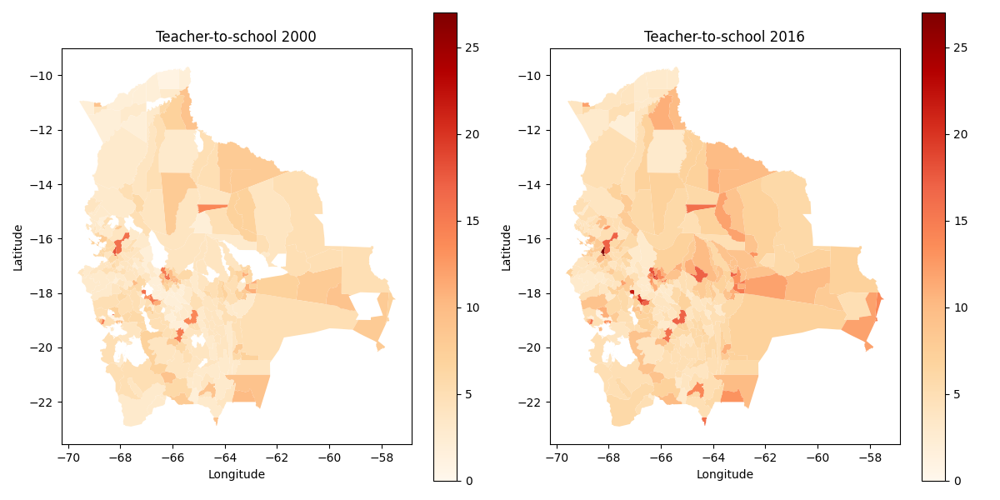

```{r setup, include=FALSE}
knitr::opts_chunk$set(echo = TRUE)
```

Education in Bolivia has been a subject of both triumphs and challenges, mirroring the country's efforts to bridge socio-economic gaps and promote equal opportunities for its citizens. As a nation rich in cultural diversity and history, Bolivia recognizes the importance of education as a catalyst for societal progress and personal growth. Despite its endeavors, the education system grapples with notable strengths and weaknesses, which have profound implications for its efficiency and accuracy in resource allocation. 

This article delves into some key aspects of Bolivia's education landscape, shedding light on the strides made in providing accessible education, the persistent disparities that hinder progress, and the ongoing efforts to optimize the allocation of resources to enhance the effectiveness and inclusiveness of this vital service.

## Allocation of teachers and schools

During the period from 2000 to 2016, there was a noteworthy increase in the number of teachers in schools at the national level, amounting to a significant rise of 46%. In parallel, the number of educational institutions also experienced growth, with an 8.4% increase during the same time frame. This expansion resulted in absolute increments in both the count of teachers and educational units nationwide. However, the most salient observation was the observed enhancement in the teacher-to-school ratio, which rose from 7 teachers per school in 2000 to 9 teachers per school by 2016. This positive development is associated with a series of critical advantages, encompassing advancements in educational quality, reduction of educational disparities, and reinforcement of the education system, ultimately fostering economic development.[^1]

[^1]: Statistics regarding education in Bolivia are extracted and processed with data published by the Ministry of Education of Bolivia and, secondary sources like the National Institute of Bolivia and others.  

Moreover, the augmentation in the teacher-to-school ratio has the potential to yield far-reaching benefits in the comprehensive development of the country, playing a pivotal role in the cultivation of a more prepared and skilled generation of citizens capable of confronting the challenges of the future.

Despite the observed improvement in the teacher-to-school ratio at the national level, it is essential to acknowledge that this situation may not be uniformly distributed across municipalities. Consequently, a thorough calculation and analysis of the evolution of this ratio are conducted, focusing specifically on the municipalities of Bolivia.

The plot presented below displays the distributions of municipal data concerning the teacher-to-school ratio for the years 2000 and 2016. It is noteworthy that the mode of the distribution corresponding to 2016 surpasses that of 2000, consistent with the national-level finding of an improvement in this ratio. Additionally, it is observed that the mode of the municipal data for both 2016 and 2000 falls below the corresponding national ratio (9 teachers per school at the national level in 2016, and 7 in 2000). This observation indicates that the allocation of teachers per school in the majority of municipalities tends to concentrate around values lower than the national ratio.

```{r, echo=FALSE}
knitr::include_graphics("Education/edu_plt1.png")
```

Furthermore, the subsequent maps illustrate that, by 2016, a considerable number of municipalities exhibited an enhancement in their teacher-to-school ratio in comparison to their status in 2000. Nonetheless, it is evident that the most significant progress in this indicator is concentrated primarily in municipalities encompassing capital cities and those situated in close proximity to them.

```{r, echo=FALSE}

```


