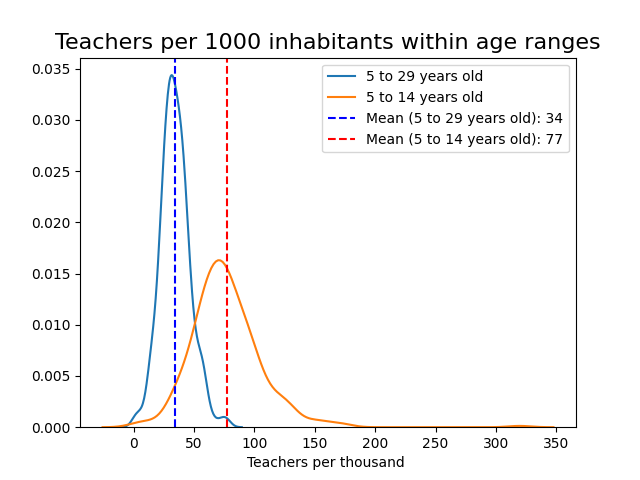

```{r setup, include=FALSE}
knitr::opts_chunk$set(echo = TRUE)
```

Education in Bolivia has been a subject of both triumphs and challenges, mirroring the country's efforts to bridge socio-economic gaps and promote equal opportunities for its citizens. As a nation rich in cultural diversity and history, Bolivia recognizes the importance of education as a catalyst for societal progress and personal growth. Despite its endeavors, the education system grapples with notable strengths and weaknesses, which have profound implications for its efficiency and accuracy in resource allocation.

This article delves into some key aspects of Bolivia's education landscape, shedding light on the strides made in providing accessible education, the persistent disparities that hinder progress, and the ongoing efforts to optimize the allocation of resources to enhance the effectiveness and inclusiveness of this vital service.

## Allocation of teachers

### Teacher-to-school ratio

During the period from 2000 to 2016, there was a noteworthy increase in the number of teachers in schools at the national level, amounting to a significant rise of 46%. In parallel, the number of educational institutions also experienced growth, with an 8.4% increase during the same time frame. This expansion resulted in absolute increments in both the count of teachers and educational units nationwide. However, the most salient observation was the observed enhancement in the teacher-to-school ratio, which rose from 7 teachers per school in 2000 to 9 teachers per school by 2016. This positive development is associated with a series of critical advantages, encompassing advancements in educational quality, reduction of educational disparities, and reinforcement of the education system, ultimately fostering economic development.[^1]

[^1]: Statistics regarding education in Bolivia are extracted and processed with data published by the Ministry of Education of Bolivia and, secondary sources like the National Institute of Bolivia and others.

Moreover, the augmentation in the teacher-to-school ratio has the potential to yield far-reaching benefits in the comprehensive development of the country, playing a pivotal role in the cultivation of a more prepared and skilled generation of citizens capable of confronting the challenges of the future.

Despite the observed improvement in the teacher-to-school ratio at the national level, it is essential to acknowledge that this situation may not be uniformly distributed across municipalities. Consequently, a thorough calculation and analysis of the evolution of this ratio are conducted, focusing specifically on the municipalities of Bolivia.

The plot presented below displays the distributions of municipal data concerning the teacher-to-school ratio for the years 2000 and 2016. It is noteworthy that the mode of the distribution corresponding to 2016 surpasses that of 2000, consistent with the national-level finding of an improvement in this ratio. Additionally, it is observed that the mode of the municipal data for both 2016 and 2000 falls below the corresponding national ratio (9 teachers per school at the national level in 2016, and 7 in 2000). This observation indicates that the allocation of teachers per school in the majority of municipalities tends to concentrate around values lower than the national ratio.

```{r, echo=FALSE}

```

Furthermore, the subsequent maps illustrate that, by 2016, a considerable number of municipalities exhibited an enhancement in their teacher-to-school ratio in comparison to their status in 2000. Nonetheless, it is evident that the most significant progress in this indicator is concentrated primarily in municipalities encompassing capital cities and those situated in close proximity to them.

```{r, echo=FALSE}


```

In the year 2016, notable municipalities with the most elevated teacher-to-school ratios were El Alto (27), Colcapihua (24), Oruro (22), and Villa Huanuni (20). In particular, these municipalities attained a ratio of 20 or higher, a value that surpasses even that of capital cities such as Nuestra Señora de La Paz, Cochabamba, or Santa Cruz de la Sierra. Moreover, it is crucial to underscore that these municipalities exhibited a significant advancement in the allocation of teachers between 2000 and 2016.


| Department | Municipality | 2000 | 2016 |
|------------|--------------|------|------|
|La Paz|	El Alto|	18.0|	27.0|
|Cochabamba|	Colcapirhua|	18.0|	24.0|
|Oruro|	Oruro|	16.0|	22.0|
|Oruro|	Villa Huanuni|	15.0|	20.0|
|Cochabamba|	Quillacollo|	15.0|	18.0|
|Potosi|	Llallagua|	11.0|	17.0|
|Chuquisaca|	Sucre|	14.0|	17.0|
|Cochabamba|	Cochabamba|	16.0|	17.0|
|La Paz|	Nuestra Senora de La Paz|	16.0|	17.0|
|Santa Cruz|	Montero|	11.0|	17.0|
: 10th highest teacher-to-school municipalities


### Teacher-to-inhabitants

Upon calculating the ratio of teachers per 1000 inhabitants within the age range of 5 to 29 years, a potential age group benefiting from the education service, a relatively symmetrical distribution of this indicator is observed. Approximately 50% of municipalities would possess a minimum (or maximum) availability of 36 teachers per 1000 individuals within the specified age range.[^2] 

```{r, echo=FALSE}

```


[^2]: It is essential to acknowledge that the population data utilized is based on the records from the National Population and Housing Census 2012, considering the limited information available.

To explore potential determinants influencing the allocation of teachers per 1000 inhabitants (within the age range of 5 to 29 years), a logit model was estimated, and the resulting marginal effects are presented in the following table. The dependent variable in this model is a dummy variable, taking the value of 1 for municipalities with a ratio of teachers per 1000 inhabitants higher than the average in 2016. The explanatory variables utilized are based on data from the year 2012, as more up-to-date information on these variables is unavailable. This approach also allows for an interpretation in line with past needs or characteristics of the municipalities that may influence the probability of registering ratios of teachers per 1000 inhabitants higher than the average.

  
|Dep. Variable: 1 if teacher-to-1000 > mean| dy/dx  |
|-----------------------------------------------|--------|
|% population attending secondary school|10.5578***|  
| | (2.552) |
|% population attending public school  |6.9818***  |
| | (1.562) |
|% population not attending school     |5.1757***  |
| | (1.337) |
|% Rural Population                    |0.5188***  |      
| | (0.131) |      
|Years of education (mean)             |-0.0787*** |
| | (0.030) |
|% Spanish-spoken population           |0.2120     |   
| | (0.305) |
|% population attending primary school |-8.7773    |
| | (31.025) |
|Illiteracy rate                       |-0.0233    |
| | (0.017) |
|Poverty rate                          |-0.0040    |
| | (0.003) |
|Municipal Health Index                |-0.4963    |
| | (0.520) |
|Pseudo R-squ.: | 0.2434 |
|No. Observations: | 339 |
: Logit model: Teacher-to-1000-inhabitants marginal effects. Standard errors are shown in parentheses. *** indicates statistical significance at the 1% level.

Preliminary findings reveal several intriguing observations. Notably, the likelihood of having a ratio of teachers per 1000 inhabitants above the average is positively associated with a higher proportion of the population attending the secondary level. Similarly, in municipalities with a greater proportion of the population attending public schools, the probability of assigning more teachers per 1000 inhabitants increases.

Conversely, a higher probability of having a higher ratio of teachers per 1000 inhabitants in 2016 is observed for municipalities that displayed a relatively high percentage of their population not attending any educational unit in 2012. This could indicate a prioritization of teacher allocation in municipalities with lower participation in formal educational learning.

However, factors such as poverty, illiteracy, and health conditions, which could potentially increase the socioeconomic vulnerability of the population and merit consideration in teacher assignment, do not demonstrate a statistically significant effect on the probability that a municipality has a ratio of teachers per 1000 inhabitants above the average.


## Concluding Insights 

Optimally allocating teachers among municipalities in Bolivia requires a comprehensive and strategic approach that takes into account the unique needs and challenges faced by each region. To begin with, there should be a thorough assessment of the educational infrastructure and resources in different municipalities to identify areas with the most significant deficits in teacher availability. Based on this evaluation, priority should be given to regions experiencing teacher shortages, particularly in remote and underserved areas. Offering incentives such as improved housing facilities, financial incentives, and professional development opportunities can help attract and retain teachers in these regions.

Furthermore, the allocation process should consider factors such as student-to-teacher ratios, ensuring that class sizes are manageable to facilitate individualized attention and support for students. Special emphasis should be placed on recruiting teachers proficient in local languages and knowledgeable about the cultural contexts of indigenous communities to foster inclusive and culturally relevant education.

Moreover, technology can play a crucial role in optimizing teacher allocation. Virtual learning platforms and online training programs can bridge the geographical gap between urban centers and remote areas, allowing teachers to reach a broader student population effectively.

Collaboration between educational authorities, teachers' associations, and local communities is essential to identify the specific needs and aspirations of each municipality. This participatory approach will enable the formulation of targeted policies and initiatives that address the unique challenges faced by each region, ensuring a more equitable and efficient allocation of teachers throughout Bolivia's diverse landscape. By pursuing these strategies, Bolivia can work towards providing quality education for all its citizens, fostering a more inclusive and prosperous future for the nation.

