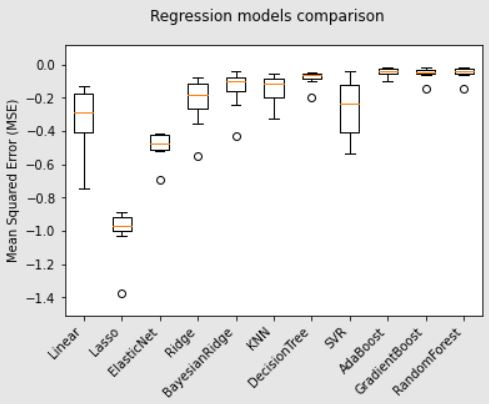

```{r setup, include=FALSE}
knitr::opts_chunk$set(echo = TRUE)
```

## Results

In the case of Bolivia, as in several developing countries, data on GDP or other indicators of economic activity suffer from limitations such as late publication, a low level of disaggregation and low frequency. Specifically, although time series of quarterly GDP or the monthly Global Index of Economic Activity are available in Bolivia, they are usually published with a delay of between three and six months.

As a proposal to overcome these limitations, I have developed a monthly GDP nowcast indicator for the Bolivian economy. I adopt the terminology of Giannone et al. (2008) and Banbura et al. (2013) regarding the definition of nowcast, which is: "forecast values of a time series, not published by official sources, for the current period".[^1]

[^1]: Banbura, M., Giannone, D., Modugno, M. & Reichlin, L. (2013). *Now-casting and the realtime data flow*. Handbook of economic forecasting (pp. 195-237). Elsevier.

    Giannone, D., Reichlin, L. & Small, D. (2008). *Nowcasting: The real-time informational content of macroeconomic data*. Journal of Monetary Economics, 55(4), 665-676. <https://doi.org/10.1016/j.jmoneco.2008.05.010>

Below, the results of the monthly GDP nowcast indicator show that the Bolivian economy would have grown by 3.5% until December 2022.

```{r, echo=FALSE}
htmltools::includeHTML("Nowcast/nowcast.html")
```

Machine learning algorithms were used to forecast Bolivia's monthly economic activity. The following sections dig deeper into the methodological approach.

## Methodology

### Model Selection Process

k-Fold Cross-Validation. I try out **regression methods** such as:

-   Linear Regression
-   Lasso
-   ElasticNet Regression
-   Ridge Regression:
-   K Neighbors Regressor
-   Decision Tree Regressor
-   Simple Vector Regression (SVR)
-   Ada Boost Regressor
-   Gradient Boosting Regressor
-   Random Forest Regression
-   Extra Trees Regressor

```{r, echo=FALSE, warning=FALSE, error=FALSE, message=FALSE}
# Model performance table
library(tidyverse)
library(kableExtra)
model <- c("Linear", "Lasso", "ElasticNet", "Ridge", "Bayesian Ridge", "KNN", "Decision Tree", "SVR", "AdaBoost", "Gradient Boost", "Random Forest")
mean <- c(-0.34, -1.00, -0.48, -0.22, -0.14, -0.15, -0.08, -0.27, -0.04, -0.05, -0.05)
sd <- c(0.20, 0.13, 0.08, 0.14, 0.11, 0.09, 0.04, 0.17, 0.02, 0.04, 0.04)
model_performance <- data.frame(Model = model, Mean = mean, SD = sd)

knitr::kable(model_performance, format = "html", table.attr = "style='width:50%;'", caption = "Models comparison: Mean Squared Error distribution by algorithm") %>% kableExtra::kable_styling()

```


```{r pressure, echo=FALSE, out.width = '50%', fig.align = "center"}

```

```{r, echo=FALSE}
htmltools::includeHTML("Nowcast/validation_plot.html")
```


### Data

Features used to forecast monthly GDP are.
