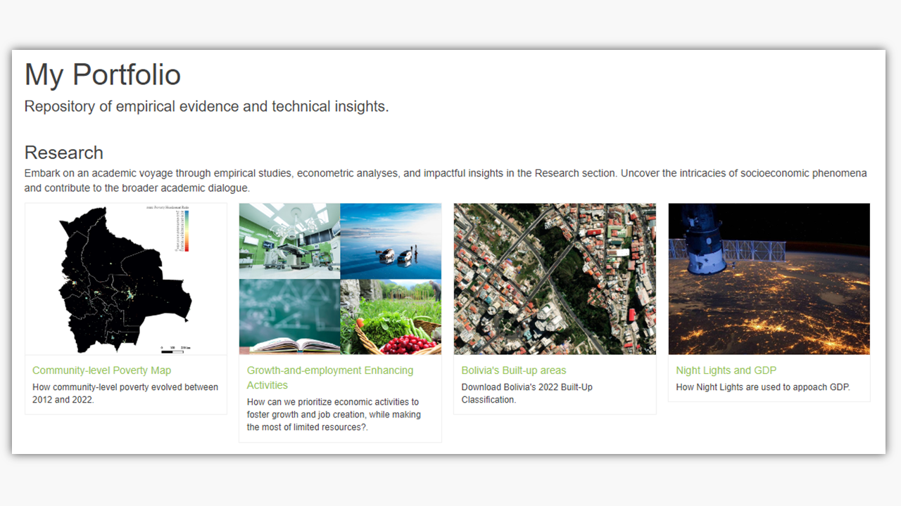
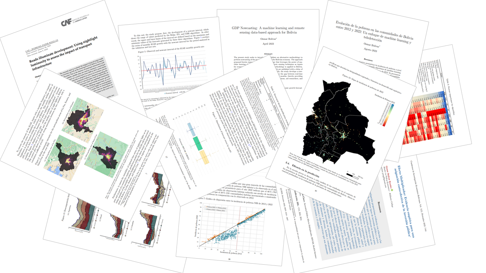

```{js, echo=FALSE}
$("#rStudioHeader").removeClass("alwaysShrunk");
$("#pageContent").removeClass("standardPadding");
```


<!--html_preserve-->

<div id="homeContent">
  <div class="band full orange first rightText">
    <div class="bandContent vCenter">
      <div class="blurb">
        <div class="tagline">A Little About Myself.</div>
        <div>Passionate about leveraging quantitative analysis to drive impactful insights in economics. Proficient in econometrics, machine learning and remote sensing for cutting-edge socioeconomic analysis. Eager to perpetuate the fusion of data and policy for meaningful societal impact.</div>
      </div>
      <div class="actions">
        <div><a href="portfolio.html"><button class="bigButton getStarted">Learn more</button></a></div>
        </div>
    </div>
    
  </div>

  <div class="band full gray1 second leftText">
    <div class="bandContent vCenter">
      <div class="blurb">
        <div>
        Explore a repository of empirical evidence and technical insights designed to foster in-depth exploration and dialogue on the structural and conjunctural aspects of Bolivia's economy and global regions. This platform aspires to offer content that not only serves academic investigation but also proves instrumental in the formulation of data-driven policies.
        </div>
        <div class="actions">
        <div><a href="portfolio.html"><button class="bigButton gallery">My Portfolio</button></a></div>
        </div>
      </div>
    </div>
    
  </div>

  <div class="band full third rightText">
    
    <div class="bandContent vCenter">
      <div class="blurb">
        <div>
        Uncover the depth of my research through academic journals and working papers, each offering a meticulous exploration of economic phenomena.
        </div>
        <div class="actions">
          <div><a href="Papers.html"><button class="bigButton gallery">Journal/Working Papers</button></a></div>
        </div>
      </div>
    </div>
  </div>
  
  <div class="band full gray2 fourth leftText">
    <div class="bandContent vCenter">
      <div class="blurb">
        <div class="tagline">Get in touch.</div>
        <div>Should you require additional information, please do not hesitate to reach out to me.</div> 
        <div><a href="osmar.economics@gmail.com"></a></div>
        <div><a href="https://www.linkedin.com/in/osmar-bolivar-rosales/"></a></div> 
        <div><a href="https://github.com/osmarbolivar/"></a></div>
        <div><a href="https://orcid.org/0009-0002-2297-2217"></a></div>
        <div><a href="https://ideas.repec.org/f/pbo932.html"></a></div>
      </div>
    </div>
    
  </div>
</div>

<!--/html_preserve-->
