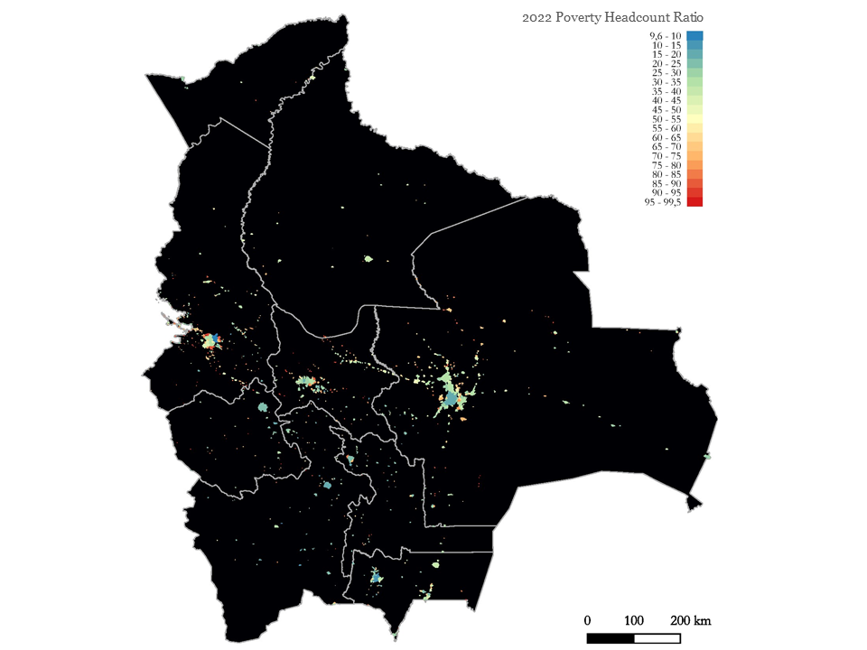
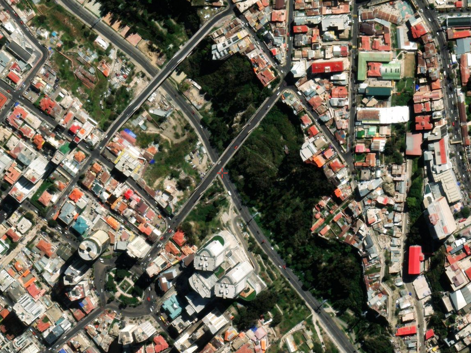

<!--html_preserve-->

  
My Portfolio

  
Repository of empirical evidence and technical insights.

  

    
Research

    
Embark on an academic voyage through empirical studies, econometric analyses, and impactful insights in the Research section. Uncover the intricacies of socioeconomic phenomena and contribute to the broader academic dialogue.

    

      

        
        <a href="http://timelyportfolio.github.io/rCharts_nyt_home_price/" class="galleryItemLabel">Community-level Poverty Map</a>
        
How community-level poverty evolved between 2012 and 2022.

      

      

        
        <a href="https://github.com/svmiller/svm-r-markdown-templates/blob/master/article-example/svm-rmarkdown-article-example.pdf" class="galleryItemLabel">Growth-and-employment Enhancing Activities</a>
        
How can we prioritize economic activities to foster growth and job creation, while making the most of limited resources?.

      

      

        
        <a href="https://github.com/svmiller/svm-r-markdown-templates/tree/master/word-example" class="galleryItemLabel">Bolivia's Built-up areas</a>
        
Download Bolivia's 2022 Built-Up Classification.

      

      

        
        <a href="https://rstudio.github.io/tufte/" class="galleryItemLabel">Night Lights and GDP</a>
        
How Night Lights are used to appoach GDP.

      

    

  

  

    
Dashboards

    
Immerse yourself in dynamic data visualization. The Dashboards section transforms complex economic data into engaging visuals, offering insightful perspectives on various economic dimensions.

    

      

        
        <a href="https://rpubs.com/jcheng/leaflet-layers-example" class="galleryItemLabel">Bolivia: Macro indicators</a>
        
GDP, inflation, unemployment and others..

      

    

  

  

    
Articles

    
Explore thought-provoking narratives in the Articles section. From in-depth analyses of structural matters to timely reflections on economic events, each article contributes to informed discussions in the realm of economics.

    

      

        
        <a href="https://bookdown.org/yihui/bookdown/" class="galleryItemLabel">Early childhood education.</a>
        
How Early childhood determines success?.

      

    

  

<!--/html_preserve-->
